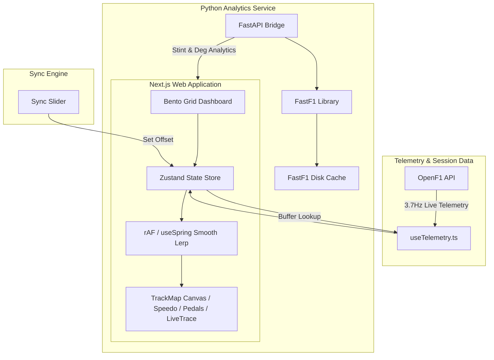

# 🏁 Apex Analysis: F1 Pit Wall & Strategy Dashboard

**Apex Analysis** is a professional-grade Formula 1 engineering console and second-screen strategy dashboard designed for F1 enthusiasts, strat-heads, and sim-racers. Built with a sleek bento-grid layout, it transforms raw real-time telemetry and GPS data into a high-density, glanceable engineering interface optimized for MacBook and iPad displays.

---

## 🌟 Key Features

*   **Bento Grid UI:** A premium, modular, and highly responsive dashboard optimized for tablet touch-interaction and laptop displays, featuring an "Engineering Dark" theme.
*   **60 FPS Live Telemetry:** Ultra-smooth velocity, RPM, throttle, and brake pressure traces driven by a custom React-bypass animation hook, ensuring zero rendering overhead.
*   **Dynamic TrackMap:** HTML5 Canvas circuit rendering showing real-time driver tracking with 60fps LERP (Linear Interpolation) movement, neon highlighting, and precise team-color synchronization.
*   **Live Timing Tower:** A real-time leader board displaying team indicators, gap to leader, and intervals with highlighting for vehicles in DRS range (< 1.0s).
*   **Tyre & Strategy Analytics:** Deep mathematical insights powered by a FastAPI Python bridge calling the FastF1 library—providing stint degradation modeling, stint timelines, cliff lap warnings, and fuel correction metrics.
*   **Broadcast Sync Engine:** A customizable 0–120s sync offset slider to align the live data stream with your TV broadcast lag or MultiViewer for F1 stream.

---

## 🏗️ System Architecture



---

## 📂 Project Structure

```
apex-analysis/
├── app/                      # Next.js App Router root
│   ├── globals.css           # Global Tailwind & Engineering Dark styles
│   ├── layout.tsx            # Global layout definition
│   └── page.tsx              # Dashboard Bento Grid entry point
├── components/               # React UI Components
│   ├── dashboard/            # High-level widgets
│   │   ├── TrackMap.tsx      # Canvas-based GPS track tracker
│   │   └── CameraFeed.tsx    # Live/onboard feed container
│   ├── layout/               # Shell components
│   │   └── SessionHeader.tsx # GP Name & Status Badge
│   ├── telemetry/            # Core dial & graph displays
│   │   ├── LiveTrace.tsx     # Recharts multi-Y-axis rolling charts
│   │   ├── Speedometer.tsx   # SVG circular gauge driven by RPM
│   │   └── Pedals.tsx        # Throttle and brake status bars
│   ├── DriverMatrix.tsx      # Interactive driver selector pill grid
│   ├── LiveTiming.tsx        # Timing tower (gaps, intervals)
│   ├── SyncSlider.tsx        # Stream sync control slider
│   └── TyreDegradation.tsx   # FastF1 tyre compound & wear analytics
├── fastf1-bridge/            # FastAPI Python Microservice
│   ├── main.py               # API Router & service entry point
│   ├── requirements.txt      # Python dependencies (FastF1, FastAPI, etc.)
│   └── routers/              # Modular analysis endpoints
├── hooks/                    # Custom React hooks
│   ├── useTelemetry.ts       # Rate-staggered poller & store update pipeline
│   └── useSmoothTelemetry.ts # 60fps RequestAnimationFrame interpolator
├── lib/                      # Base configurations & clients
│   ├── openf1.ts             # OpenF1 fetch wrapper with 429 guard
│   └── fastf1.ts             # Python bridge fetch wrapper
├── store/                    # State management
│   ├── useF1Store.ts         # High-frequency telemetry states
│   └── useTelemetryStore.ts  # Timing & active session configurations
└── README.md                 # Project overview & documentation
```

---

## ⚙️ Setup & Installation

### 1. Frontend (Next.js Dashboard)

The frontend is built with Next.js, Tailwind CSS (v4), Framer Motion, Recharts, and Zustand.

#### Prerequisites
*   Node.js (v18.x or later)
*   npm

#### Setup Steps
1.  Navigate to the project root:
    ```bash
    npm install
    ```
2.  Start the development server:
    ```bash
    npm run dev
    ```
3.  Open [http://localhost:3000](http://localhost:3000) in your web browser.

---

### 2. Backend (FastF1 FastAPI Bridge)

The backend computes advanced tyre degradation, fuel correction coefficients, and strategy stint mappings.

#### Prerequisites
*   Python 3.9+
*   Pip

#### Setup Steps
1.  Navigate to the `fastf1-bridge` directory:
    ```bash
    cd fastf1-bridge
    ```
2.  Create and activate a virtual environment:
    ```bash
    python -m venv venv
    source venv/bin/activate  # On Windows: venv\Scripts\activate
    ```
3.  Install dependencies:
    ```bash
    pip install -r requirements.txt
    ```
4.  Run the API bridge server:
    ```bash
    uvicorn main:app --reload --port 8001
    ```
    *The frontend is pre-configured to communicate with the FastAPI service on `http://localhost:8001`.*

---

## 🏎️ Engineering Insights & Performance Optimization

### 📈 React Re-render Bypass (60 FPS Performance)
Updating dials and charts at ~4Hz can cause significant lag when react triggers virtual DOM diffing on every frame. To circumvent this, **Apex Analysis** uses a subscription-based bypass:
1.  Car data updates write to the Zustand store quietly without triggering state re-renders on the container.
2.  Gauge components subscribe directly to the store via Zustand's `.subscribe()`.
3.  `useSmoothTelemetry.ts` reads values directly and uses `requestAnimationFrame` alongside Framer Motion's `useSpring` to smoothly animate SVGs and Canvas elements at 60fps, skipping the React update cycle entirely.

### 🛡️ OpenF1 Rate-Limit Safeguard
The OpenF1 API can rate-limit high-frequency requests during live races. We address this using:
*   **Staggered Ingestion:** Requests for driver details are staggered 500ms apart to prevent rate-limit cascades.
*   **Retry with Exponential Backoff:** The fetch utility in `lib/openf1.ts` catches `429` status codes and automatically backs off exponentially before retrying.

---

## 🏆 Current Testing Configurations

For stable offline validation and local simulations:
*   **Session 9159 (Singapore GP 2023):** Used for historical multi-driver stream validation and wheel-to-wheel speed analysis.
*   **Session 9165 (Silverstone 2023):** Used for live timing tower, gaps, intervals, and FastF1 tyre degradation modeling.
